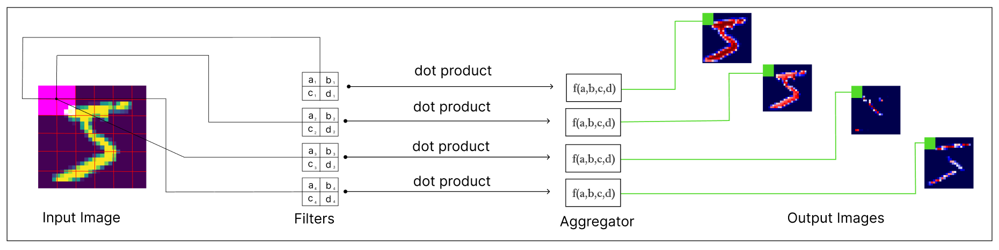
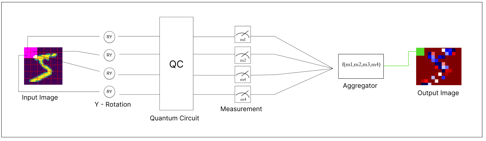
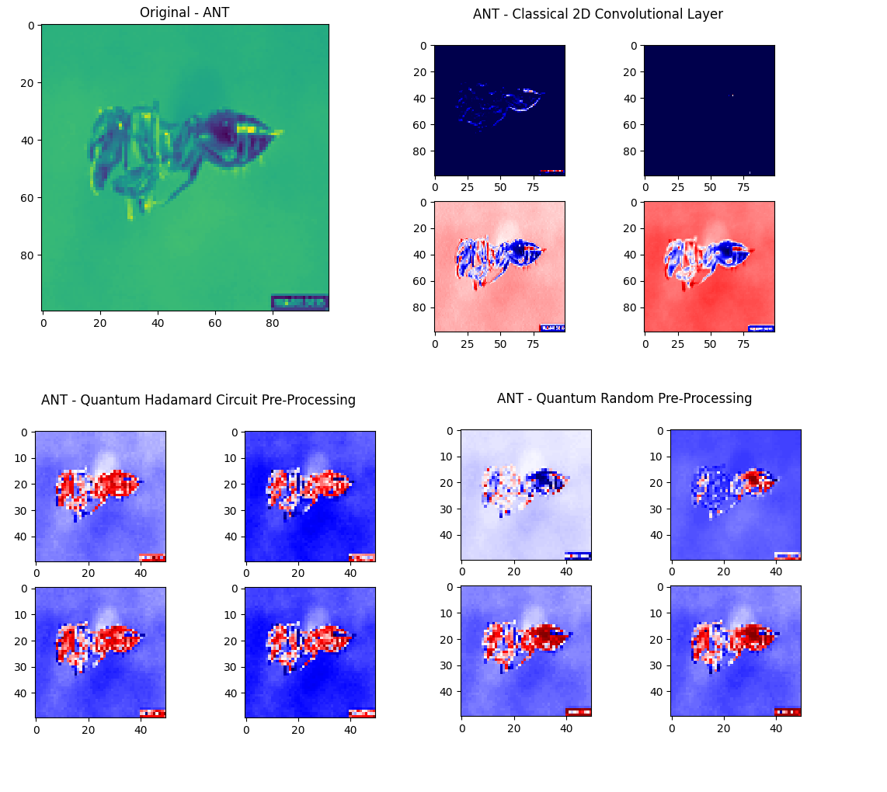
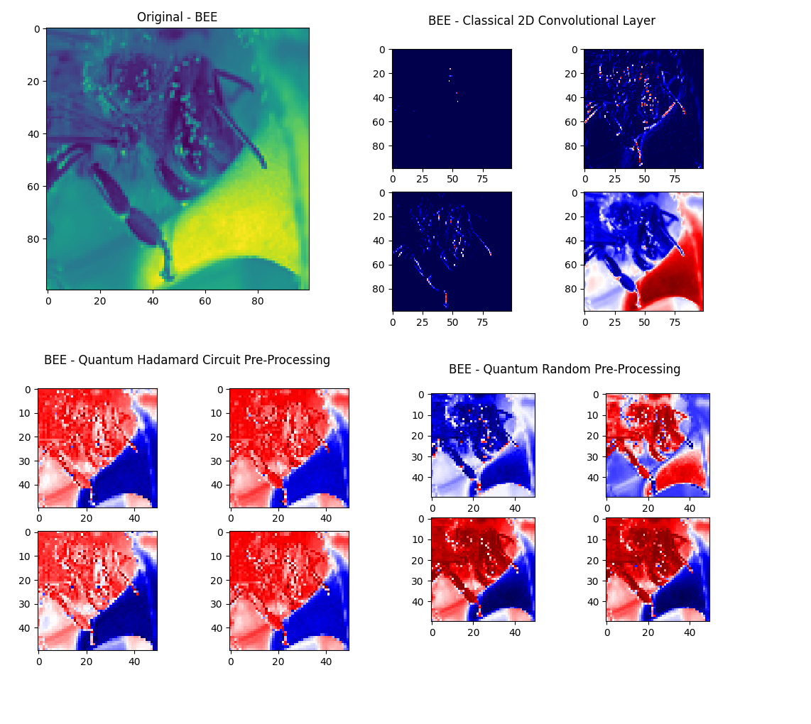
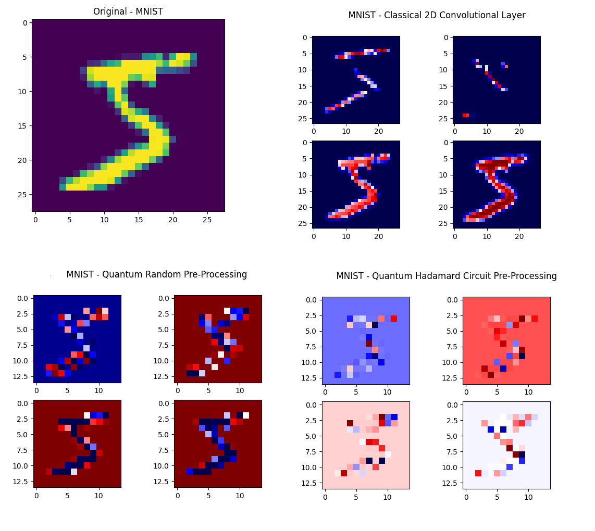
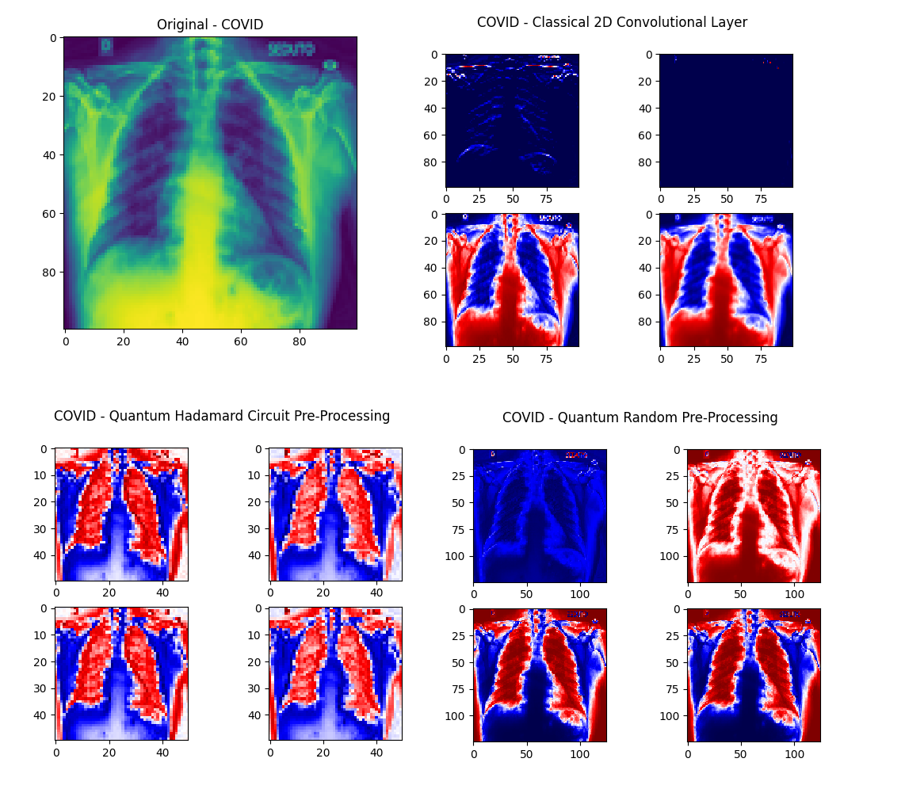
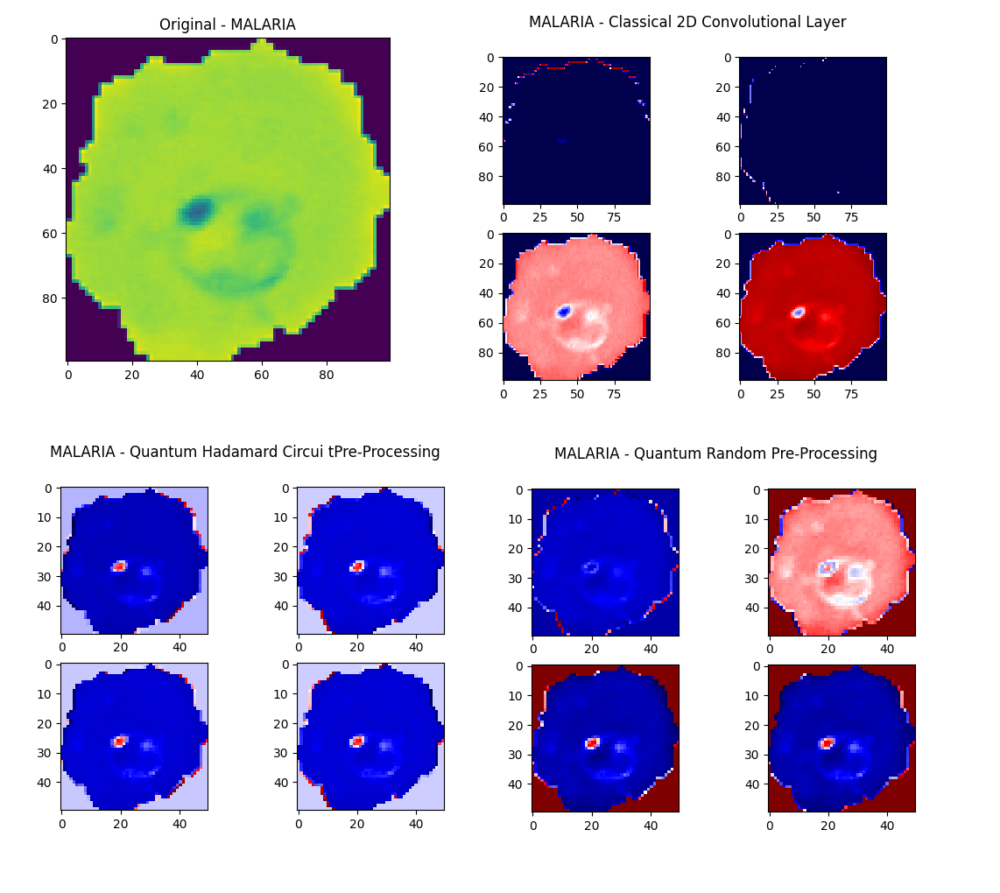

# CXQ-ML

A comparison of Classical and Quantum Machine Learning Approach for Neural Networks in <b>image classification</b>.

-------
## Idea
The Idea is simple: compare a "classical" convolutional neural network and a "quantum" convolutional neural network. The motivation came from the [quanvolutional layer](https://arxiv.org/abs/1904.04767) and the tutorial by [pennylane](https://pennylane.ai/qml/demos/tutorial_quanvolution.html). The intention was to take one step further, and apply the concepts for real world dataset scenarios, and try to visualize the effect of the quantum approach.

-------
<center><h2> Classical Convolutional Layer</h2></center>

<p align="center">
  
</p>


<center><h2> Quanvolutional Layer</h2></center>

<p align="center">
  
</p>

-------

## Conclusions
Quantum computing can help to produce the same answers that classical computing can (see Results section below). The big bottleneck currently is the limitation of number of qubits available. Classical Deep Learning has been successful due to the GPU capacity of heavy and parallel computing. Even that Quantum computers can take advantage of parallel computing by using [superposition](https://en.wikipedia.org/wiki/Quantum_superposition), the limitation of number of qubits available makes computing really slow for real dataset scenarios. For the datasets <b>ants/bee</b> from Imagenet the quantum pre-processing took a few hours and for the <b>Malaria</b> dataset, it took a couple days (reshaping g the original images to 100x100x1)

## Results

<p align="center">
  
</p>

<p align="center">
  
</p>

<p align="center">
  
</p>

<p align="center">
  
</p>

<p align="center">
  
</p>


## Install
------

### Using venv (Recommended)

```bash
# run the script below
./install.bat
```

### Installing libraries

```bash
pip install -r requirements.txt
```

## Folder Structure

```
CXQ-ML
│   visual.py
│
│
└───datasets
│   │
│   └───Covid19
│   │   │   
│   │   └───train
│   │   │     │   
│   │   │     └───Covid
│   │   │     │           
│   │   │     └───Normal
│   │   │     │           
│   │   │     └───ViralPneumonia
│   │   │   
│   │   └───test
│   │         │   
│   │         └───Covid
│   │         │           
│   │         └───Normal
│   │         │           
│   │         └───ViralPneumonia
│   │
│   └───hymenoptera_data
│   │   │   
│   │   └───train
│   │   │     │   
│   │   │     └───ants
│   │   │     │           
│   │   │     └───bees
│   │   │   
│   │   └───val
│   │         │   
│   │         └───ants
│   │         │           
│   │         └───bees
│   │
│   └───Malaria
│       │   
│       └───Parasitized
│       │   
│       └───Uninfected
│   
└───quantum/scratch
│           qml.py
│   
│   
└───classical/scratch
            classical.py
```

## Running

```bash
# classical networks
set MODEL=MNIST && python classical/scratch/classical.py
set MODEL=IMAGENET && python classical/scratch/classical.py
set MODEL=COVID && python classical/scratch/classical.py
set MODEL=MALARIA && set SIZE=0,100 && python classical/scratch/classical.py

# quantum networks (prerocess=1 passes through first quantum layer)
set MODEL=MNIST && set PREPROCESS=1 && python quantum/scratch/qml.py
set MODEL=IMAGENET && set PREPROCESS=1 && python quantum/scratch/qml.py
set MODEL=COVID && set PREPROCESS=1 && python quantum/scratch/qml.py
set MODEL=MALARIA && set PREPROCESS=1 && SET pt=1 && set SIZE=0,1000 && python quantum/scratch/qml.py

# visualizing the effect of convolutions (classical and quantum)
set MODEL=MNIST && python visual.py
```

## Flags (Environment Variables)
 - MODEL      [Mandatory]
   - Trains the Model from the List: MNIST, IMAGENET, COVID, MALARIA
 - PRINT      [Optional] 
   - Prints history of losses
 - TYPE       [Optional] - Only for quantum 
   - If PURE, trains only with quantum operations, if MIXED (default) trains with 1st layer as quanvolutional and the rest with tensorflow/keras
   - <strong>Pure Only working in MNIST for now </strong>
 - DEBUG      [Optional] 
   - Shows shapes (only available in PURE type)
 - PREPROCESS [Optional] 
   - Preprocess the dataset with the quanvolutional layer (necessary for MIXED type)

## Objective

-------
How performant is one over the other? We will try to answer this by designing two types of neural networks for each approach (Classical and Quantum). 
 - From scratch
      - training neural network with no prior knowledge
 - Using Transfer Learning
      - <del>using knowledge with networks trained in Imagenet classification</del> no longer necessary, the accuracy is already good from scratch for these examples

### Datasets

-------
The datasets that will be used are:
 - MNIST (60k Images)
    - http://yann.lecun.com/exdb/mnist/
 - Bees and Ants taken from Imagenet (240 Images)
    - https://download.pytorch.org/tutorial/hymenoptera_data.zip
 - COVID-19 X-Ray (317 Images)
    - https://www.kaggle.com/datasets/pranavraikokte/covid19-image-dataset
 - Blood Cells for Malaria prediction (27.5k Images) 
    - https://www.kaggle.com/datasets/iarunava/cell-images-for-detecting-malaria


### Tools

-------
- Classical ML
 - Tensorflow

- QML
 - Pennylane

#### TODO
- MNIST Dataset
   - Classical [X]
   - Quantum [X]
- Bees and Ants Dataset
   - Classical [X]
   - Quantum [X]
- COVID-19 X-Rays Dataset
   - Classical [X]
   - Quantum [X]
- Malaria Blood Cells Dataset
   - Classical [X]
   - Quantum [X]
- Visualization
   - Create visualization tool for Images
      - MNIST Dataset [X]
      - Bees and Ants Dataset []
      - COVID-19 X-Rays Dataset []
      - Malaria Blood Cells Dataset []
- Pure Type Implementation
   - Create Training only using quantum operations
      - MNIST Dataset [X] -- failing
      - Bees and Ants Dataset []
      - COVID-19 X-Rays Dataset []
      - Malaria Blood Cells Dataset []